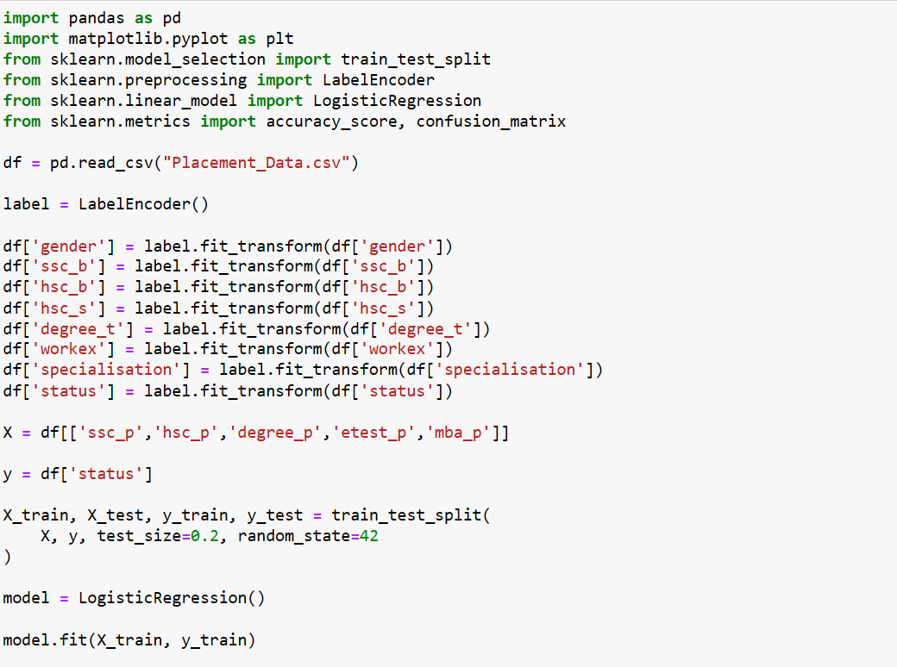
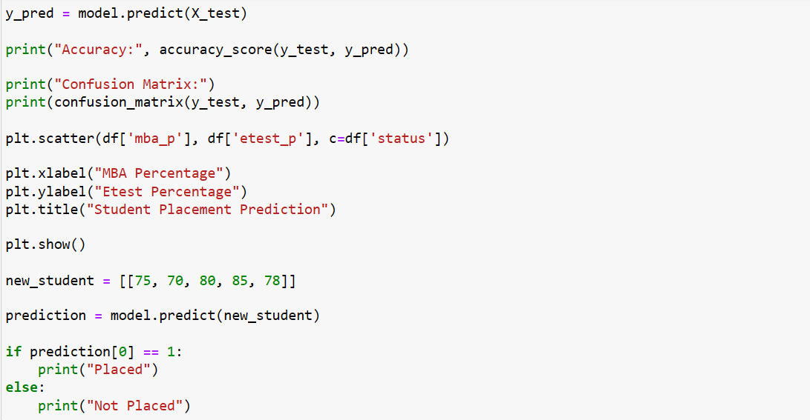
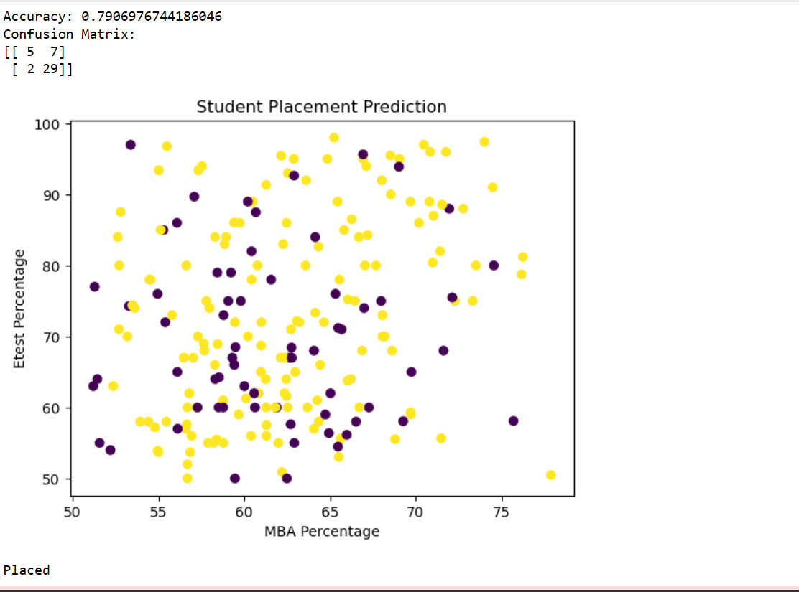

# Implementation-of-Logistic-Regression-Model-to-Predict-the-Placement-Status-of-Student

## AIM:
To write a program to implement the the Logistic Regression Model to Predict the Placement Status of Student.

## Equipments Required:
1. Hardware – PCs
2. Anaconda – Python 3.7 Installation / Jupyter notebook

## Algorithm

1. Load the placement dataset and remove unnecessary columns and duplicate values.
2. Convert categorical data into numerical values using Label Encoding.
3. Split the dataset into training and testing sets, then train the Logistic Regression model.
4. Predict the results, calculate accuracy, and display the confusion matrix and classification report.

## Program:
```
/*
Program to implement the the Logistic Regression Model to Predict the Placement Status of Student.
#Ex:No:5
#Implementation of Logistic Regression Model to Predict the Placement Status of Student

# Import required libraries
import pandas as pd
import matplotlib.pyplot as plt
from sklearn.model_selection import train_test_split
from sklearn.preprocessing import LabelEncoder
from sklearn.linear_model import LogisticRegression
from sklearn.metrics import accuracy_score, confusion_matrix

df = pd.read_csv("Placement_Data.csv")

label = LabelEncoder()

df['gender'] = label.fit_transform(df['gender'])
df['ssc_b'] = label.fit_transform(df['ssc_b'])
df['hsc_b'] = label.fit_transform(df['hsc_b'])
df['hsc_s'] = label.fit_transform(df['hsc_s'])
df['degree_t'] = label.fit_transform(df['degree_t'])
df['workex'] = label.fit_transform(df['workex'])
df['specialisation'] = label.fit_transform(df['specialisation'])
df['status'] = label.fit_transform(df['status'])

X = df[['ssc_p','hsc_p','degree_p','etest_p','mba_p']]

y = df['status']

X_train, X_test, y_train, y_test = train_test_split(
    X, y, test_size=0.2, random_state=42
)

model = LogisticRegression()

model.fit(X_train, y_train)

y_pred = model.predict(X_test)

print("Accuracy:", accuracy_score(y_test, y_pred))

print("Confusion Matrix:")
print(confusion_matrix(y_test, y_pred))

plt.scatter(df['mba_p'], df['etest_p'], c=df['status'])

plt.xlabel("MBA Percentage")
plt.ylabel("Etest Percentage")
plt.title("Student Placement Prediction")

plt.show()

new_student = [[75, 70, 80, 85, 78]]

prediction = model.predict(new_student)

if prediction[0] == 1:
    print("Placed")
else:
    print("Not Placed")


Developed by: Swathi P N
RegisterNumber: 212225230279
*/
```

## Output:







## Result:
Thus the program to implement the the Logistic Regression Model to Predict the Placement Status of Student is written and verified using python programming.
